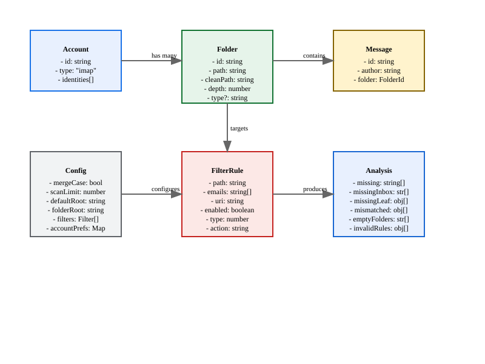
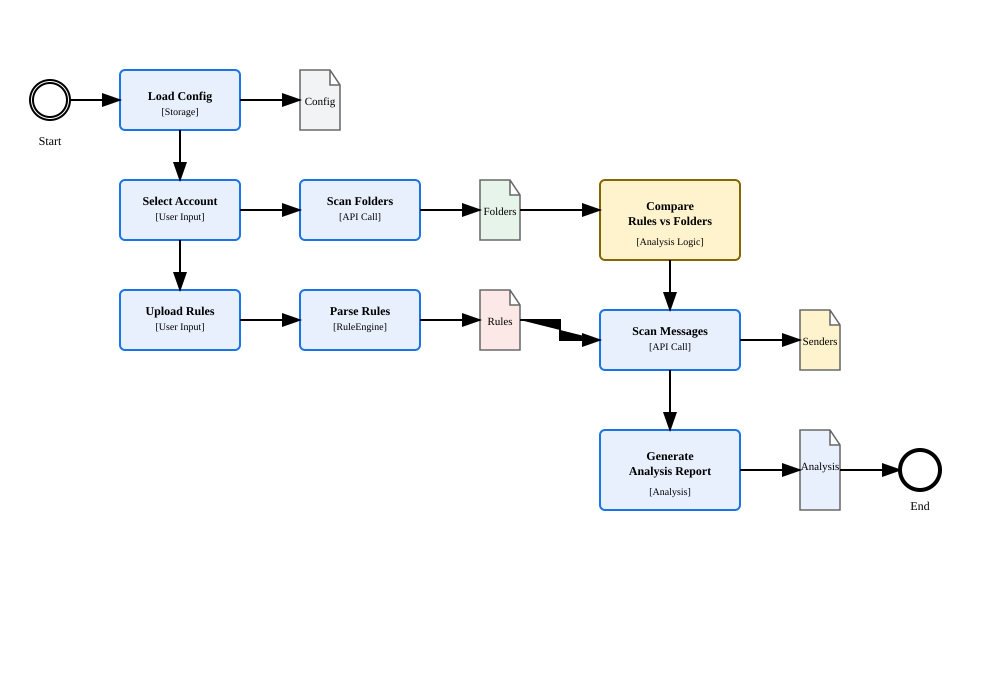
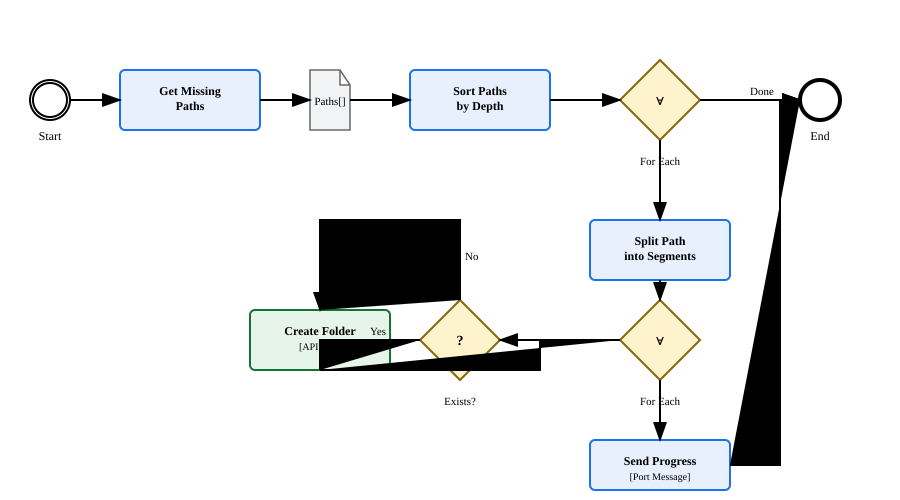

# Technical Specification

<style>
.bg-white {
	background: white;
}
</style>

Thunderbird extension analyzes filter rules. Creates missing IMAP folders. Discovers new email senders. Generates filter rules automatically.

## Features

### Core Operations

+ Parse `msgFilterRules.dat` files
+ Scan IMAP folder hierarchies
+ Create missing folders hierarchically
+ Delete empty leaf folders
+ Scan messages for sender emails
+ Generate filter rules from emails
+ Validate rule-to-folder consistency

### Analysis Operations

+ Find folders referenced in rules but missing
+ Find emails in inbox without rules
+ Find folders with emails but no rules
+ Find rules pointing to wrong folders
+ Find empty leaf folders
+ Find invalid rules (non-existent paths)

### Rule Generation

+ Generate rules from email addresses
+ Apply configurable filter type masks
+ Use reverse-domain path structure
+ Deduplicate generated rules
+ Sort rules alphabetically by path

## Architecture

### Entity Relationship

<div class="bg-white">



</div>

### BPMN Process Flow: Analysis

<div class="bg-white">



</div>

### BPMN Process Flow: Folder Creation

<div class="bg-white">



</div>

## Data Formats

### Thunderbird Filter Rule Format (msgFilterRules.dat)

```ini
version="9"
logging="no"
name="From alice@example.com"
enabled="yes"
type="48"
action="Move to folder"
actionValue="imap://user@host/com/example/alice"
condition="AND (from,contains,alice@example.com)"
```

Structure:

+ Header: `version`, `logging`
+ Rule blocks: separated by `name=` marker
+ Rule fields: `name`, `enabled`, `type`, `action`, `actionValue`, `condition`

Filter Type Bitmask:

+ `1` = Pre-Junk (Getting New Mail before junk classification)
+ `16` = Manual Run
+ `32` = Post-Junk (Getting New Mail after junk classification)
+ `64` = After Sending
+ `128` = Archiving
+ `256` = Periodic (every 10 minutes)
+ Default: `48` (16 + 32 = Manual + Post-Junk)

URI Format:

+ `imap://user@host/path/to/folder`
+ `mailbox://user@host/path/to/folder` (legacy)
+ Path segments: URL-encoded
+ Example: `imap://bob@mail.com/Archives/Clients/uk/co/example/alice`

Condition Format:

+ `AND (field,operator,value)`
+ Field: `from`, `to`, `subject`, etc.
+ Operator: `contains`, `is`, `begins with`, etc.
+ Value: unquoted string

### Path Structure

Email to Path Conversion:

```yaml
Input:  alice@example.co.uk
Output: uk/co/example/alice
```

Algorithm:

1. Split email at @ → [alice, example.co.uk]
2. Split domain by . → [example, co, uk]
3. Reverse domain → [uk, co, example]
4. Append user → [uk, co, example, alice]
5. Join with / → uk/co/example/alice

*Root Path Composition:

```yaml
Target Root: Archives/Clients
Email Path:  uk/co/example/alice
Result:      Archives/Clients/uk/co/example/alice
```

### API Data Structures

Folder Object:

```typescript
interface Folder {
  id: string           // Thunderbird folder ID
  name: string         // Folder name (last segment)
  path: string         // Full path with leading slash
  cleanPath: string    // Path without leading slash
  depth: number        // Hierarchy depth (0 = root)
  type?: string        // Special type: inbox, trash, sent, etc.
}
```

Parsed Rule Object:

```typescript
interface FilterRule {
  path: string         // Target folder path (clean)
  emails: string[]     // Email addresses in condition
  uri: string          // Full IMAP URI
  enabled: boolean     // Rule enabled state
  type?: number        // Filter type bitmask
  action?: string      // Action type
}
```

Analysis Result:

```typescript
interface Analysis {
  missing: string[]                    // Folders in rules but not on server
  missingInboxRules: string[]          // Emails in inbox without rules
  missingLeafRules: AnalysisItem[]     // Valid folders without rules
  mismatchedFolders: AnalysisItem[]    // Rules pointing to wrong paths
  emptyLeafFolders: string[]           // Leaf folders with no messages
  invalidRules: AnalysisItem[]         // Rules with non-existent paths
}

interface AnalysisItem {
  email: string
  expectedPath: string
  actualPath?: string
  rulePath?: string
}
```

Configuration Object:

```typescript
interface Config {
  mergeCase: boolean              // Case-insensitive folder matching
  scanLimit: number               // Messages to scan (100-5000)
  defaultRoot: string             // Default target root path
  folderRoot: string              // Preferred creation root
  filters: FilterConfig[]         // Filter type defaults
  accountPreferences: {
    [accountId: string]: {
      source: FolderSelection?    // Preferred scan source
      target: FolderSelection?    // Preferred target root
    }
  }
}

interface FilterConfig {
  id: string                      // Filter identifier
  value: number                   // Bitmask value
  label: string                   // I18n key
  enabled: boolean                // Default enabled state
}

interface FolderSelection {
  id: string                      // Folder ID
  cleanPath: string               // Folder clean path
}
```

## Thunderbird APIs

### Accounts API

```javascript
// List accounts
const accounts = await messenger.accounts.list()
// Returns: MailAccount[]

// Get account
const account = await messenger.accounts.get(accountId)
// Returns: MailAccount with folders property
```

### Folders API

```javascript
// Get folder
const folder = await messenger.folders.get(folderId)
// Returns: MailFolder

// Get subfolders
const subs = await messenger.folders.getSubFolders(folderId)
// Returns: MailFolder[]

// Create folder
const newFolder = await messenger.folders.create(parentId, name)
// Returns: MailFolder

// Delete folder
await messenger.folders.delete(folderId)
// Returns: void
```

### Messages API

```javascript
// List messages
const page = await messenger.messages.list(folderId)
// Returns: MessageList { messages: MessageHeader[], id?: string }

// Continue pagination
const nextPage = await messenger.messages.continueList(pageId)
// Returns: MessageList
```

### Runtime Messaging

```javascript
// Send message
const response = await messenger.runtime.sendMessage({
  action: 'analyze',
  accountId: '...',
  filterContent: '...',
  mergeCase: true,
  rootPath: '...'
})
// Returns: { ok: boolean, data?: any, error?: string }

// Connect port (long-running operations)
const port = messenger.runtime.connect({ name: 'create-folders' })
port.onMessage.addListener(msg => {
  // msg.type: 'progress' | 'complete' | 'error'
})
port.postMessage({ action: 'create', accountId, paths, preferredRoot })
```

### Storage API

```javascript
// Get from sync storage (with local fallback)
const data = await messenger.storage.sync.get(keys)
// Returns: object with requested keys

// Set to sync storage
await messenger.storage.sync.set({ key: value })

// Listen for changes
messenger.storage.onChanged.addListener((changes, areaName) => {
  // changes: { [key]: { oldValue, newValue } }
  // areaName: 'sync' | 'local'
})
```

### Downloads API

```javascript
// Download file
await messenger.downloads.download({
  url: blobUrl,
  filename: 'msgFilterRules.dat',
  saveAs: true
})
```

## UI Requirements

### Layout Structure

+ Container: max-width 850px, centered
+ Header: title + settings button
+ Shared config section: account, folders, rules textarea
+ Tabbed interface: Missing Folders + Rule Discovery
+ Modal overlay: settings iframe

### Tab 1: Missing Folders Analysis

Inputs:

+ IMAP Account dropdown
+ Scan Source Folder dropdown (searchable)
+ Target Root Path dropdown (searchable) + Auto-Detect button
+ File upload for msgFilterRules.dat
+ Textarea for pasted rules (collapsible, expands on focus)
+ Checkbox: Merge case-insensitive duplicates
+ Metadata info: rule count, Sort Rules button, Apply Defaults button

Stats Display:

+ Total Folders (scoped to root)
+ Leaf Folders (scoped to root)
+ Filter Rules (total parsed)
+ Unique Leaf Paths (from rules)
+ Missing Folders count + inline Create button

Actions:

+ Analyze Missing Folders button
+ Download Rules button

Analysis Results (expandable details):

+ Missing Rules (Inbox): count + Generate button + list
+ Missing Rules (Valid Folders): count + Generate button + list
+ Mismatched Folders: count + Generate button + list
+ Empty Leaf Folders: count + Delete button + list
+ Invalid Rules: count + Delete button + list
+ Missing Folders: list + Create button
+ Analysis Report: formatted text
+ Inbox Debug Report: formatted text (dev)
+ Leaf Debug Report: formatted text (dev)

### Tab 2: Rule Discovery

Inputs:

+ Scan Source Folder (reuses shared config)
+ Target Root Path (reuses shared config)
+ Scan Messages button (shows scan limit in label)

Results Table:

+ Checkbox column (select/deselect all)
+ Email column (sortable)
+ Proposed Path column (sortable)
+ Row click toggles selection
+ Selected rows highlighted

Actions:

+ Create N Folders button (creates selected)
+ Generate Rules Only button (appends to textarea)

### Settings Modal

Sections:

+ Analysis Settings: merge case checkbox
+ Default Filter Triggers: checkboxes for 6 filter types
+ Discovery Settings: scan limit dropdown, default root input, folder root dropdown
+ Save Preferences button

Behavior:

+ Opens as modal overlay
+ Contains iframe loading options.html
+ Real-time sync via storage.onChanged
+ Closes on backdrop click or X button

### Visual States

Processing Indicators:

+ Spinner icon in button or section header
+ Progress messages: "3/10: Archives/Clients/uk/co/example/alice"
+ Disabled buttons during operations
+ Status messages: info (blue), success (green), error (red), warning (yellow)

Interactive Elements:

+ Buttons: primary (blue), secondary (gray border), link-button (borderless)
+ Icon buttons: circular, hover background
+ Expandable details: `<details>` with summary
+ Tabs: CSS-only radio button implementation
+ Sortable headers: click to cycle none → asc → desc

### Responsive Behavior

+ Mobile-friendly card layout
+ Input groups: flex with gap
+ Discovery table scrolls horizontally if needed
+ Modal: 90vw max width, 90vh max height
+ Lists: max-height with scroll

### Accessibility

+ ARIA labels on icon buttons
+ Live regions for status updates (aria-live="polite")
+ Keyboard navigation support
+ Focus indicators
+ Color-blind friendly status colors
+ Reduced motion support (prefers-reduced-motion)

## Error Handling

### User-Facing Errors

+ No IMAP accounts found
+ Account load failure
+ Folder scan permission denied
+ Message scan timeout
+ Folder creation failure (per-folder)
+ Folder deletion failure (per-folder, with retry logic)
+ Invalid msgFilterRules.dat format
+ Storage quota exceeded

### Developer Errors (Console)

+ Missing parent folder in hierarchy
+ Regex pattern mismatch
+ API response validation failure
+ Storage fallback triggered
+ Folder existence verification failure

### Validation

+ Email address format (must contain @)
+ Root path existence before setting
+ Filter type bitmask range (1-511)
+ Scan limit range (100-5000)
+ Special folder protection (cannot delete inbox, trash, sent, etc.)
+ Case collision warnings (path differs only by case from existing)
+ URL encoding warnings (path contains special characters)

## Performance Requirements

### Limits

+ Folder scan: recursive, parallel traversal
+ Message scan: paginated, abort after limit
+ Folder creation: sequential, hierarchical (parent before child)
+ Folder deletion: reverse depth order (deepest first)

### Optimization

+ Memoize folder statistics
+ Debounce search inputs
+ Lazy-load discovery results
+ Batch folder operations
+ Cache parsed rules
+ Deduplicate rules before save

### Constraints

+ Scan limit: 100-5000 messages
+ Folder depth: typically ≤10 levels
+ Rule count: typically ≤500 rules
+ Concurrent API calls: managed by Thunderbird
+ Storage quota: sync (100KB), local (unlimited)

## Internationalization

### Supported Locales

+ en (English) - default

### Message Keys Pattern

+ Feature areas: `tab*`, `btn*`, `stat*`
+ Actions: verbs in imperative mood
+ States: past participle (analyzing, creating)
+ Placeholders: `$COUNT$`, `$PATH$`, `$CURRENT$`, `$TOTAL$`, `$CREATED$`, `$FAILED$`

### Extension Points

+ Add `/ext/_locales/{locale}/messages.json`
+ Update `default_locale` in manifest.json
+ All UI strings externalized to messages.json
